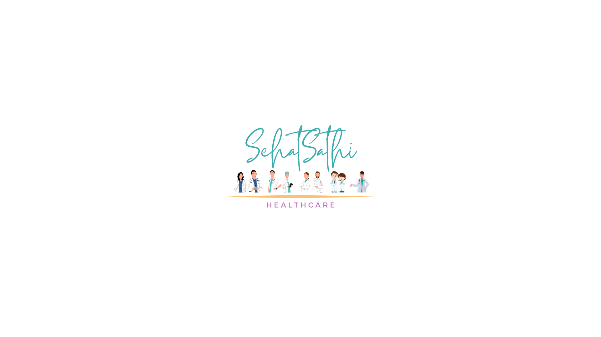

# SehatSaathi: Elevating Healthcare Operations to New Horizons 

<h1 align="center">
  
   
  SehatSaathi: Elevating Healthcare Operations to New Horizons 
   
</h1>

<h4 align="center">SehatSathi introduces an intelligent doctor appointment system with disease prediction and doctor availability check using facial recognition, enhancing healthcare accessibility and efficiency.</h4>

## Problem Identified

The existing doctor appointment systems lack efficiency and user-friendly interfaces, leading to inconvenience for patients and inefficiencies in scheduling for healthcare providers. Moreover, traditional appointment systems do not utilize advanced technologies like machine learning for disease prediction, resulting in missed opportunities for early diagnosis and treatment. There is a need for a modernized appointment system that integrates machine learning algorithms for disease prediction, provides intuitive interfaces for users, and offers efficient scheduling mechanisms for healthcare providers. This project addresses these shortcomings by developing a comprehensive solution that revolutionizes the doctor appointment process while leveraging cutting-edge technology for improved healthcare outcomes.

## 🚀 Proposed Solution: Introducing SehatSathi!

Welcome to the future of healthcare! Say goodbye to traditional appointment systems and hello to SehatSathi, your intelligent healthcare companion.

### What is SehatSathi?

SehatSathi is an advanced doctor appointment system that revolutionizes healthcare accessibility and efficiency. It integrates cutting-edge technology, including machine learning for disease prediction and doctor availability check using facial recognition, to provide a seamless and personalized healthcare experience.

### How Does It Work?

SehatSathi utilizes sophisticated machine learning algorithms to predict potential diseases based on reported symptoms, empowering users to take proactive steps towards their health. Additionally, it employs facial recognition technology to streamline doctor availability checks, ensuring efficient scheduling practices.

### Features Tailored For You:

- **Disease Prediction:** Receive accurate predictions of potential diseases based on reported symptoms, guiding proactive healthcare decisions.
- **Doctor Availability Check:** Seamlessly assess doctor availability using facial recognition technology, optimizing appointment scheduling and reducing waiting times.
- **Multi-user Login:** Enjoy a tailored experience with user-specific functionalities for administrators, patients, and doctors.
- **Chatbot Integration:** Receive real-time assistance and guidance through a user-friendly chatbot, making the appointment booking process intuitive and efficient.

### Tech Stack

This section lists major frameworks and libraries used in the project.

* 
* 
* 
* 
* 
* 
* 
* 
* 
* 
* 

### Installation / Usage

Will add it soon after completion of the entire project
<!-- CONTRIBUTING -->
## Contributing

Contributions are welcome and appreciated! Here's how you can contribute to this project:

1. **Fork** the project.
2. Create a new **branch** for your feature or bug fix (`git checkout -b feature/YourFeature` or `git checkout -b bugfix/YourBugFix`).
3. **Commit** your changes (`git commit -am 'Add some feature'` or `git commit -am 'Fix some bug'`).
4. **Push** your branch to your fork on GitHub (`git push origin feature/YourFeature` or `git push origin bugfix/YourBugFix`).
5. Submit a **pull request** to the `main` branch of this repository.

If you have any suggestions for improvements, feature requests, or encounter any issues, please feel free to open an issue.

Your contributions help make this project better for everyone. Thank you for your help! 🙌

## Support

If you encounter any issues or have questions, we're here to help!

- **Issues:** If you encounter any problems with the application, please [open an issue](https://github.com/kaushikp020603/SehatSathi/issues) on the repository. We'll do our best to address it promptly.

- **General Inquiries:** For general inquiries or further assistance, feel free to reach out to the project maintainers:
  - [Kaushik](mailto:kaushik020603@gmail.com)
  - [Amogh](mailto:amoghmparulekar@gmail.com)
  - [Ajit](mailto:ajitnoob@gmail.com)
  - [Riya](mailto:riyanoob@gmail.com)

Don't hesitate to contact us. We're here to support you!

## Acknowledgments:
   - Special thanks to Amogh Parulekar, Ajit Pawar and Riya Patel for their contributions to this project

## License:
   - This project is licensed under the [MIT License](LICENSE).

